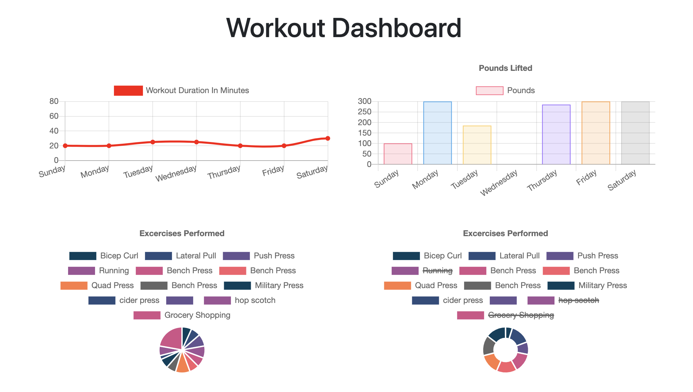
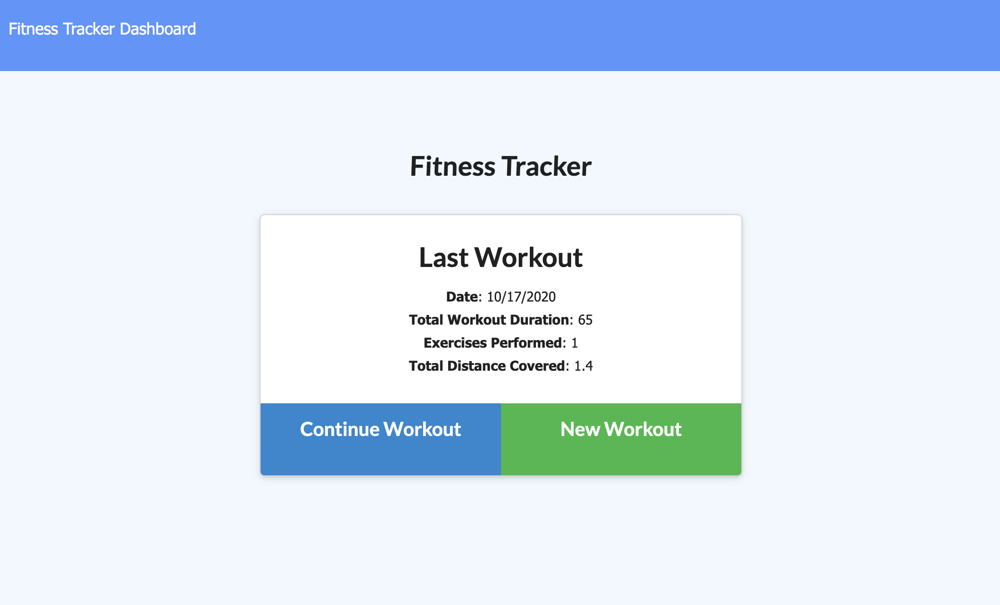

# Mongo-Workout-Watcher
An easy to use workout tracker that employs NoSQL to store user data.

Mongo Workout Watcher is a personal fitness tracker that helps users record workout and visualize past performance.

[You can view the deployed app here:](https://mongo-workout-watcher.herokuapp.com/ "View Mongo Workout Watcher") https://mongo-workout-watcher.herokuapp.com/

## Table of Contents
- [Usage](#How-to-use)
- [Technologies](#Languages-and-Lessons)
- [Contribute](#How-to-contribute)
- [Questions](#Developed-by)
- [Credits](#Acknowledgments-and-Credits)
- [License](#Licensed-under-MIT)

## How to use
The app is very easy to use. Start by creating a workout, complete the fields then click "Add Exercise" button. View the dashboard by clicking "Fitness Tracker Dashboard" text at the top left.

## Technologies
 - Node.js
 - Express
 - MongoDB/Atlas
 - Mongoose
 - Heroku

The exercises in this project focussed on learning NoSQL with Mongo and interacting with the database using Mongoose and Node. Other vital tech used included Express, Heroku Deployment. This project also had a hidden lesson of needing to read/learn/and work within someone elses existing code.

## How to contribute
If anyone would like to improve the app by contributing, they're welcome to fork it and submit a pull request on [GitHub](https://github.com/keiththarp/Mongo-Workout-Watcher).

## Developed by
- [Keith Tharp](https://github.com/keiththarp)

Please reach out with questions at:
  - keithstharp@gmail.com

Find more of Keith Tharp's work at:
  - https://github.com/keiththarp

## Acknowledgments and Credits
Thank you to all my fellow students and study groups that helped and supported with this homework project!
Special thanks to [Bobby](https://github.com/rhoffman103) & [Mike](https://github.com/FearMichael) for helping me get over the final hurdle!

## Licensed under MIT
[Click here for more information on the MIT license.](https://choosealicense.com/licenses/mit/)

